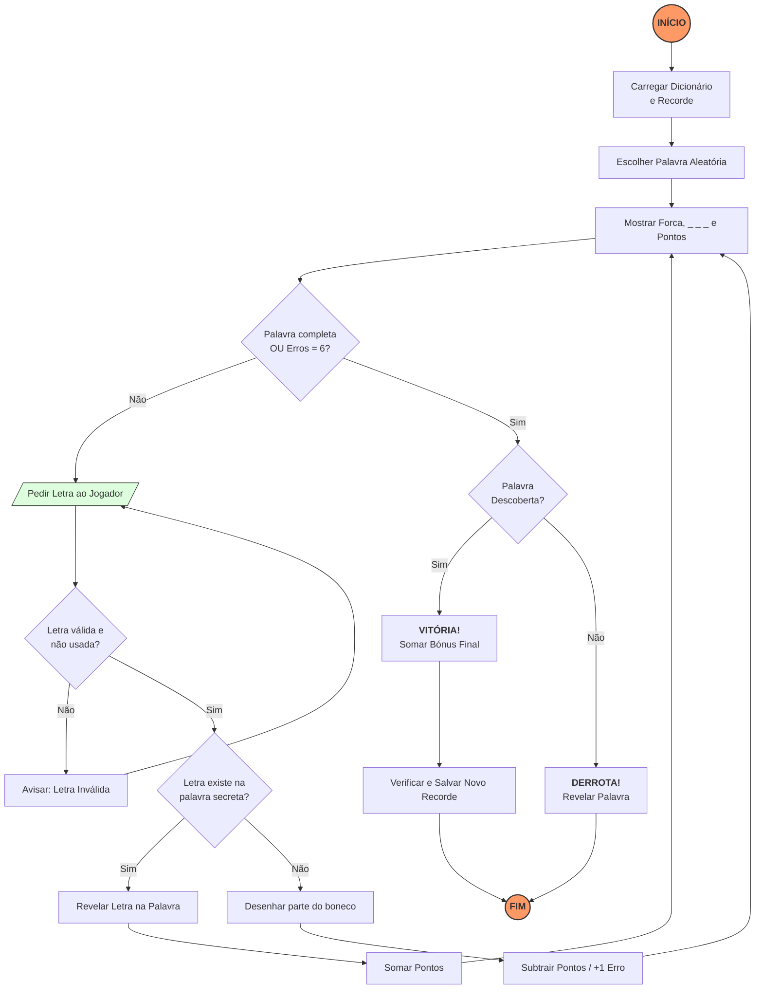

```mermaid
flowchart TD
    %% Estilos
    classDef inicio_fim fill:#f96,stroke:#333,stroke-width:2px;
    classDef processo fill:#fff,stroke:#333,stroke-width:1px;
    classDef decisao fill:#bbf,stroke:#333,stroke-width:1px;
    classDef input fill:#dfd,stroke:#333,stroke-width:1px;

    Start((<b>INÍCIO</b>)):::inicio_fim --> Load[Carregar Dicionário<br>e Recorde]
    Load --> Pick[Escolher Palavra Aleatória]
    
    %% Loop Principal
    Pick --> Display[Mostrar Forca, _ _ _ e Pontos]
    Display --> WinCheck{Palavra completa<br>OU Erros = 6?}
    
    %% Processamento de Input
    WinCheck -- Não --> Input[/Pedir Letra ao Jogador/]:::input
    Input --> Valid{Letra válida e<br>não usada?}
    
    Valid -- Não --> MsgErro[Avisar: Letra Inválida]
    MsgErro --> Input
    
    Valid -- Sim --> Match{Letra existe na<br>palavra secreta?}
    
    %% Lógica de Acerto/Erro
    Match -- Sim --> Reveal[Revelar Letra na Palavra]
    Reveal --> AddPoints[Somar Pontos]
    AddPoints --> Display
    
    Match -- Não --> Hang[Desenhar parte do boneco]
    Hang --> SubPoints[Subtrair Pontos / +1 Erro]
    SubPoints --> Display
    
    %% Finalização
    WinCheck -- Sim --> Victory{Palavra<br>Descoberta?}
    
    Victory -- Sim --> WinMsg[<b>VITÓRIA!</b><br>Somar Bónus Final]
    Victory -- Não --> LoseMsg[<b>DERROTA!</b><br>Revelar Palavra]
    
    WinMsg --> Save[Verificar e Salvar Novo Recorde]
    LoseMsg --> End((<b>FIM</b>)):::inicio_fim
    Save --> End
```
